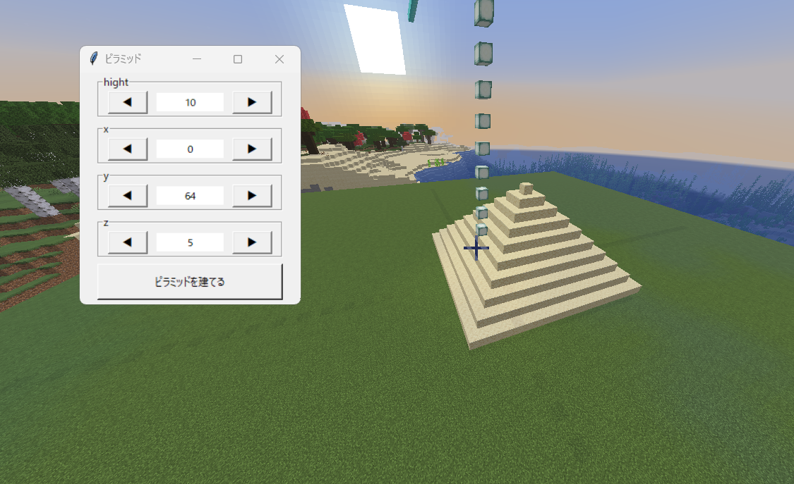

# easy_ui / soichi-10

ファイルをインポートすることで関数を簡単に定義することができるuiを出すことができるapiです。
eazy_ui.py
***
9期生 13番 白栁湊一朗

--

## このapiに必要なコード

最低限必要なコードはAPI_description.pyの通りで、
```
import time
from easy_ui import MultiNumericUI
```
２つのインポート、
```
def print_values1(v):
    print(v["パワー"], v["スピード"])

def print_values2(v):
    print(v["回数"])
```
実行するプログラムのコードに
```
v["名前"]
```
で代入、

--

```
MultiNumericUI(
    title="パラメータ調整ツール",
    items={
        "パワー": 10,
        "スピード": 5,
        "回数": 1
    },
    buttons={
        "現在の値を表示1": print_values1,
        "現在の値を表示2": print_values2
    }
)
```
```
titleがウィンドウの名前
```
```
itemsが設定する関数の名前
```
```
buttonsがどのdef文に代入するかの設定
```
UIの表示、
```
while True:
    time.sleep(1)
```
ウィンドウの待機のコードです。


---

# easy_pyramid / soichi-10

高さ、座標をapiで出したウィンドウで設定して、ピラミッドを建築するプログラムです。
easy_pyramid.py
***
9期生 13番 白栁湊一朗

--

## 使用例


このようにウィンドウで設定して建築することができます。

--

## コード

```
import time
from mcje.minecraft import Minecraft
import param_MCJE as param
from param_MCJE import PLAYER_ORIGIN as po
from easy_ui import MultiNumericUI

mc = Minecraft.create(address=param.ADRS_MCR, port=param.PORT_MCR)
mc.setPlayer(param.PLAYER_NAME, po.x, po.y, po.z)

def build_pyramid(v):
    h = v["hight"]
    x = v["x"]
    y = v["y"]
    z = v["z"]

    for i in range(h):
        size = h - 1 - i
        mc.setBlocks(x-size, y+i, z-size, x+size, y+i, z+size, param.SANDSTONE)


MultiNumericUI(
    title="ピラミッド",
    items={
        "hight": 5,
        "x": 0,
        "y": 64,
        "z": 0
    },
    buttons={
        "ピラミッドを建てる": build_pyramid
    }
)

while True:
    time.sleep(1)
```

---

## 今後

今は数字の指定で矢印で一ずつの変更しかできないので、

- 選択肢の中からの選択での設定
- 入力での設定
- 数字以外の英語や日本語など
- ウィンドウ上で操作などをするプログラムへの組み込み

ができるようにしたいです。